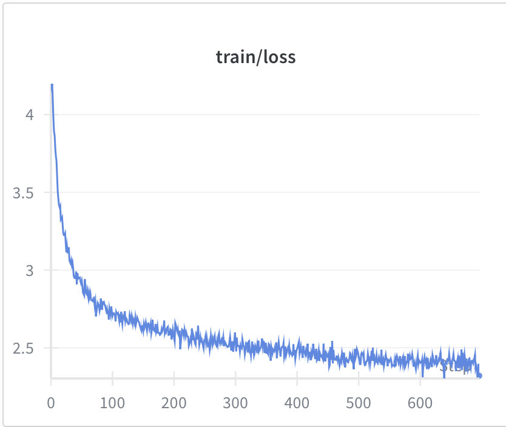
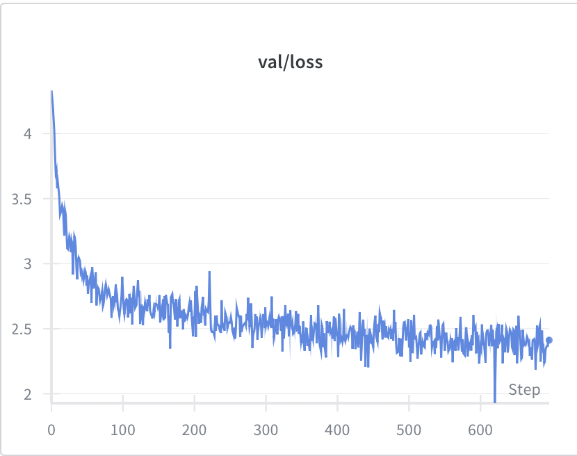
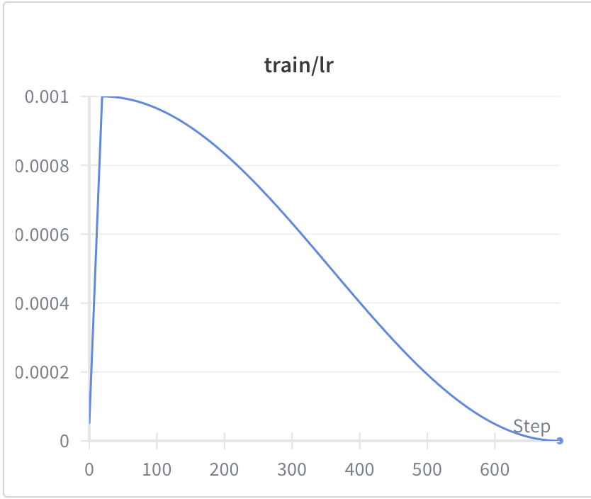
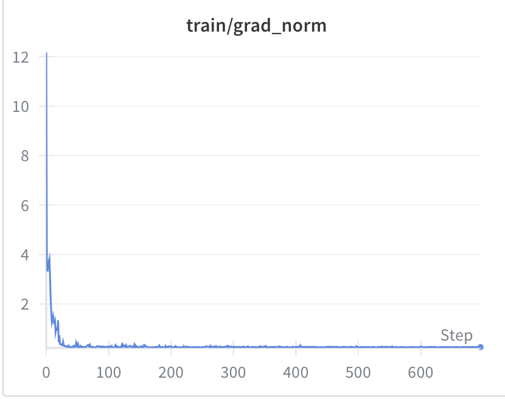
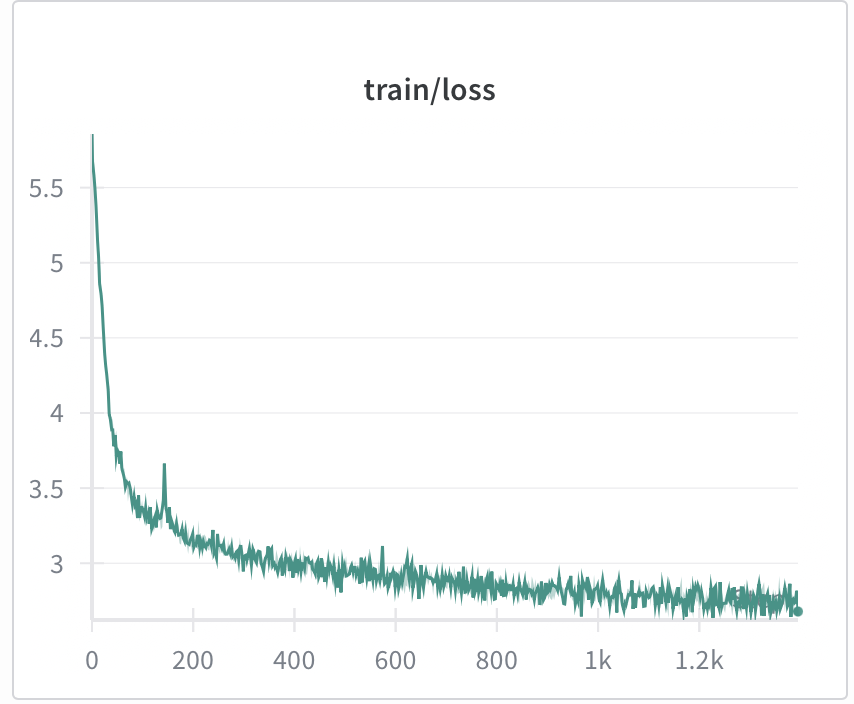
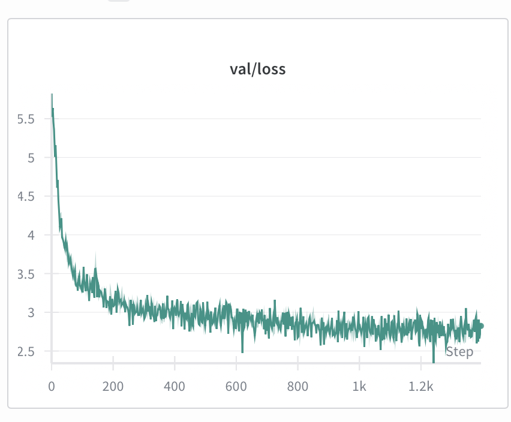
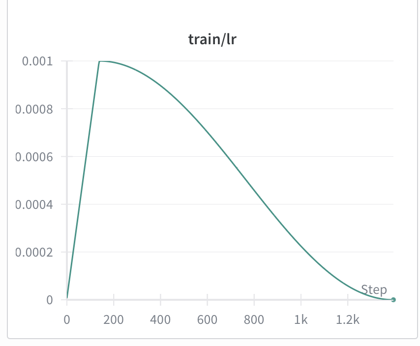
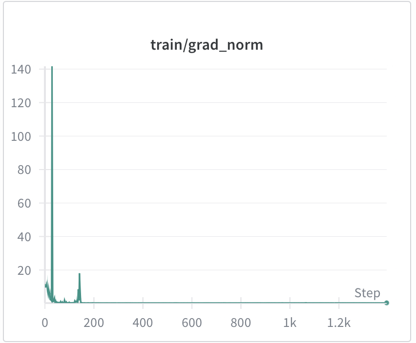

## TinyVLM

The aim of this repository to build minimal, hackable codebase to train a small vision language model with pretrained language model and pretrained vision encoder. This project is inspired from the works like HuggingFace's [nanoVLM](https://github.com/huggingface/nanoVLM) repository and [LLaVa](https://arxiv.org/pdf/2304.08485).

It took nearly 1$ to train the modality projection! I had rented a A40 GPU from [runpod](https://www.runpod.io) for the work.

### Why?

Small models are very useful for the following reasons -
- Inference costs are low
- Data Privacy and security when running on local devices
- Lower latency
- Perform at par with larger models in specific tasks

My curiousity was whether the small language models which were pretrained just on text (text-in, text-out), can they visually see and percieve the world as we humans do.

The total number of parameters of the proposed model is roughly 300 Million!

### Methodology

The methodology uses [SmolLM2-Instruct](https://huggingface.co/HuggingFaceTB/SmolLM2-135M-Instruct) model by HuggingFace and [SigLip](https://huggingface.co/google/siglip-base-patch16-224) by Google. The idea was to learn a mapping in between image embeddings generated by the visual encoder with the text embedding space by a projector which we call it as <b><u>Modality Projector</b></u>. This codebase uses <b>SwiGLU</b> MLP layer which has become a standard replacement of naive MLP in modern transformer model training.

The objective of the model training was - given an image and user prompt, learn the weights of the modality projector such that the text generation as an assistant's text matches the ground truth caption.

[LLaVA-CC3M-Pretrain-595K](https://huggingface.co/datasets/liuhaotian/LLaVA-CC3M-Pretrain-595K) was used for training the projector. This is the same dataset which was used in pretraining of the LLaVa Model.

### Run

Download the dataset and the weights of the langauge model and visual encoder.

```bash
git lfs install
git clone https://huggingface.co/datasets/liuhaotian/LLaVA-CC3M-Pretrain-595K
git clone https://huggingface.co/HuggingFaceTB/SmolLM2-135M-Instruct
git clone https://huggingface.co/google/siglip-base-patch16-224

mkdir data models
mv LLaVA-CC3M-Pretrain-595K/ data/
mv SmolLM2-135M-Instruct/ models/
mv siglip-base-patch16-224/ models/
```

Using uv, create a virtual environment

```bash
uv sync
```

Train the model projection by running the following command

```bash
python main.py
```

Note: Make sure you use w&b to monitor the training. If you want to change the configurations (batch size, gradient accumulation), you can take a look at ```VLMConfig``` in the ```main.py``` file.

The checkpoint for the modality projector can be found [here](https://drive.google.com/drive/folders/1UV8tv9igWMFoj1abi2cpNzfOhcB4F5Kx?usp=sharing).

### Results


| Training Loss | Validation Loss | Learning Rate | Gradient Norm |
|---|---|---|---|
|  |  |  |  |
-----------

You can also test the inference and the performace by running ``` python -m tests.infer```. The following is the output generation.

```bash
=== Inference Example buildings.png ===
Image Path: buildings.png
Generated Text: a view of the skyline with buildings and a sunset over city – time lapse shot - 120 seconds .
=========================
=== Inference Example bird.png ===
Image Path: bird.png
Generated Text: picture of birds in a tree – one with its beak open, another pecking at the same fruit while it flies through branches. The scene is simply stunning and shows just how beautiful nature can be when you have an abundance to enjoy!
by .
=========================
=== Inference Example beach.png ===
Image Path: beach.png
Generated Text: sounds like a perfect summer afternoon . the beach is bustling with people and cars going about their business as they enjoy some time to themselves. at noon, many of us are also out walking around our respective properties in order not be too far away from
=========================
```

The result shows that the mapping is doing decent, atleast it tries to understand a high level understanding of images which is good considering the size of the model. But for some images, the model doesn't generate anything. So, there is a good room for improvement in terms of pretrained model choices, modality projector architecture, dataset chosen (since, its bit noisy) and training configurations!

#### Update 

I also tried using SmolLM2-360M-Instruct as the pretrained LLM to train the modality projector. Here are the training statistics.

| Training Loss | Validation Loss | Learning Rate | Gradient Norm |
|---|---|---|---|
|  |  |  |  |
-----------

The model attained a higher loss in comparison to SmolLM2-135M though.

Here is how SmolLM2-360M-Instruct works on the examples images

```bash
=== Inference Example buildings.png ===
Image Path: buildings.png
Generated Text: The image depicts a cityscape with an early morning sunrise over the skyscrapers of downtown Manhattan, taken during sunset on August 23rd at approximately two hours before local time. The sky is gradually illuminated by orange and pink hues as sunlight casts its golden
=========================
=== Inference Example bird.png ===
Image Path: bird.png
Generated Text: a beautiful bird perched on a branch with flowers in the distance .
Person - person is an animal that lives among people and loves to play around them , but they often keep their thoughts inside themselves when it comes time for socializing or interacting. Person �
=========================
=== Inference Example beach.png ===
Image Path: beach.png
Generated Text: image copyright david hartman / bf images
A man walks along the beach on a sunny day . The view from an observation deck overlooking downtown , person looking out at sea and cityscape below - zoomed in for more detail. A
=========================
```

### ToDos

- [ ] Finetune the model similar to Llava paper on downstream tasks
- [ ] Benchmark the results on downstream tasks
